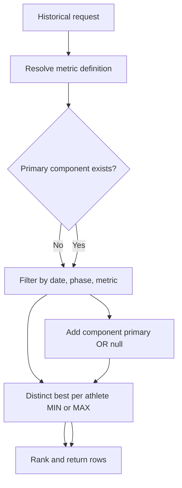

# Design: Historical best-mark selection for cumulative metrics

**Date:** 2026-03-20  
**Project:** `lcaspeedjournal-webapp-clean`  
**Scope:** Historical page bug only (no session leaderboard behavior changes)

## 1. Problem and goals

### Problem

The historical leaderboard endpoint currently ranks each athlete's "best" mark by filtering only on `metric_key`. For cumulative time metrics such as `20m_Accel`, stored rows may include multiple components under the same metric key (`0-5m`, `0-10m`, `0-20m`, etc.). Because time metrics are ranked ascending, the query can incorrectly choose a short split (~0.7-0.8s) instead of the full-run mark (~2.6s+). This produces visibly invalid historical rankings for acceleration metrics.

### Goals

- Ensure historical best-mark selection for cumulative metrics uses the full-run component.
- Preserve compatibility with legacy rows where `component` may be null.
- Keep the fix minimal and localized to historical behavior.
- Align historical behavior with existing cumulative handling already used in progression/PR paths.

### Non-goals

- Changing session leaderboard defaults.
- Changing parser/storage format.
- Backfilling or migrating existing data.

---

## 2. Approaches considered

### Recommended: server-side component filter in historical API

Use `getPrimaryComponent(metric)` and apply:

- `e.component = primary OR e.component IS NULL` when the metric is cumulative.
- Existing behavior for non-cumulative metrics.

Why this is recommended:

- Smallest safe change with predictable behavior.
- Matches current compatibility pattern used by athlete PR logic.
- Keeps API output correct for all consumers, not just the current page.

### Alternative A: strict primary only

Use `e.component = primary` only. This is semantically cleaner, but it can drop valid legacy marks when older rows lack `component`.

### Alternative B: client-side filtering

Filter bad rows after API response. This is not recommended because the API remains wrong and other consumers can still receive invalid "best" marks.

---

## 3. Architecture and data flow

Only one endpoint needs to change:

- `src/app/api/leaderboard/historical/route.ts`

Current flow:

1. Client calls `/api/leaderboard/historical` with date range + metric.
2. API decides sort direction from metric units (`s` => ascending, else descending).
3. API computes one best row per athlete with `DISTINCT ON (athlete_id)`.

Updated flow (cumulative-safe):

1. Resolve metric definition from registry.
2. Resolve `primary = getPrimaryComponent(metric, registry)`.
3. Build the filtered CTE:
   - If `primary == null`: keep current metric-only filter.
   - If `primary != null`: add `(e.component = primary OR e.component IS NULL)`.
4. Run existing ASC/DESC best-row selection and ranking unchanged.

---

## 4. Error handling and edge cases

- Unknown metric handling remains unchanged (400 response).
- Max Velocity path remains unchanged (separate multi-key logic).
- For cumulative metrics with partial legacy data:
  - Full-run rows with null component continue to count.
  - Non-primary component splits no longer win historical best-mark ranking.
- If a cumulative metric is misconfigured without valid splits, `getPrimaryComponent` returns null and endpoint safely falls back to current behavior.

---

## 5. Test and verification plan

### Code-level tests

Add a focused regression test for historical best-mark selection:

- Seed one athlete with two `20m_Accel` rows in range:
  - `component = 0-5m`, `display_value = 0.75`
  - `component = 0-20m`, `display_value = 2.80`
- Assert historical API returns `2.80` for that athlete's best mark.

Also include a legacy compatibility case:

- `component = null` full-run row should still be eligible for best-mark.

### Manual validation

- Open historical page, choose `20m_Accel`, date range with known data.
- Confirm displayed values are in full-run range (roughly 2.6s+).
- Compare against progression for the same athlete/metric/date window.
- Smoke-check one non-cumulative metric and Max Velocity to confirm no regressions.

---

## 6. Rollout

1. Implement route change in historical API.
2. Add/adjust regression tests.
3. Run lint/tests for touched files.
4. Verify in app with known `20m_Accel` data.
5. Deploy as a narrow bugfix.
